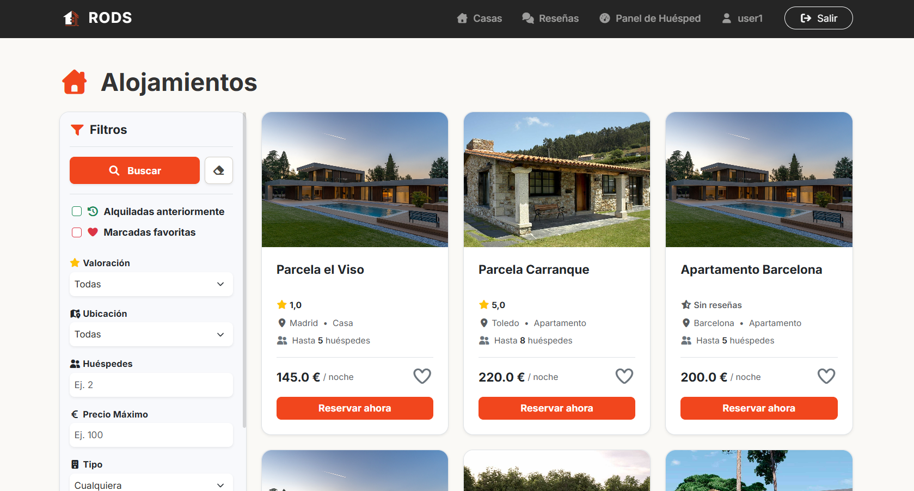

# Alquiler Vacacional - Plataforma G3
Una aplicación web de alquiler vacacional inspirada en Airbnb, desarrollada colaborativamente con Spring Boot 4.0 y Java 25. Permite a los usuarios publicar alojamientos, realizar reservas con pasarela de pago ficticia, agregar valoraciones por estrellas, guardar favoritos y recomendar casas a través de una agenda de contactos integrada.




## 📖 ¿Qué es?
Este proyecto es una plataforma web de alquiler vacacional simplificada desarrollada de manera colaborativa por el **Grupo 3**. El propósito principal es servir como un entorno práctico de aprendizaje para implementar:
* Arquitectura basada en capas utilizando **Spring Boot 4.x** y **Java 25**.
* Persistencia relacional en base de datos H2 en memoria mediante **Spring Data JPA**.
* Renderizado dinámico en el servidor a través de vistas **Thymeleaf** estilizadas con Bootstrap y FontAwesome.
* Flujos de autenticación, registro y control de acceso robustos utilizando **Spring Security**.

## ✨ Funcionalidades y Aspectos Claves
La aplicación cuenta con las siguientes características implementadas y operativas:

### 1. Gestión de Alojamientos (Houses)
* Creación, edición, activación/desactivación y visualización detallada de alojamientos.
* **Motor de Búsqueda y Filtros Avanzados:** Permite filtrar alojamientos de manera combinada utilizando criterios como:
  * Título (búsqueda parcial insensible a mayúsculas/minúsculas).
  * Provincia (mediante enums predefinidos).
  * Tipo de alojamiento (apartamento, casa, habitación).
  * Rango de precios y capacidad máxima de huéspedes.
  * Equipamientos específicos (Amenities).
  * Calificación media mínima basada en las valoraciones de los usuarios.
  * Alojamientos marcados como favoritos.

### 2. Gestión de Reservas (Bookings) y Pagos Ficticios
* Los huéspedes pueden solicitar una reserva seleccionando fechas de entrada (`check-in`) y salida (`check-out`) estimadas.
* El sistema calcula de forma automática el total de noches de estancia y el precio acumulado de la reserva.
* **Pasarela de Pago Ficticia:** Para confirmar la reserva, la plataforma incluye un flujo de pago con tarjeta de crédito/débito que realiza validaciones en tiempo real:
  * Número de tarjeta válido (exactamente 16 dígitos).
  * Caducidad con formato válido `MM/YY`.
  * Código secreto CVV de 3 dígitos.
  * Nombre del titular obligatorio.
* Seguimiento y transición de los estados de la reserva (`PENDING`, `CONFIRMED`, `CANCELLED`, `COMPLETED`).
* Validación automática contra solapamiento de fechas para evitar que un alojamiento sea reservado en un mismo período.

### 3. Sistema de Agenda y Recomendaciones de Alojamientos
* **Token de Recomendación:** Cada usuario registrado cuenta con un identificador único alfanumérico generado dinámicamente (`tokenforRecommended`).
* **Envío de Recomendaciones:** Un usuario puede recomendar un alojamiento específico a otro usuario indicando ya sea el **correo electrónico** o el **token único** del destinatario.
* **Validación de Duplicados:** El sistema impide recomendar una misma casa al mismo usuario dos veces para evitar spam.
* **Sección de Agenda (`/agenda`):** Los usuarios pueden visualizar una lista con otros miembros y los contadores en tiempo real de recomendaciones que han enviado y recibido mutuamente.
* **Bandeja de Entrada de Recomendaciones:** Listado de recomendaciones recibidas con la opción de marcarlas como leídas/vistas (`viewed = true`).

### 4. Favoritos y Valoraciones
* **Favoritos (Favorites):** Sistema interactivo para añadir o quitar alojamientos del listado de favoritos con un solo clic.
* **Valoraciones (Reviews):** Los huéspedes que han completado sus estancias pueden valorar el alojamiento con comentarios de texto y una puntuación numérica (de 1 a 5 estrellas).

## 👥 Roles de Usuario y Permisos
El acceso a las distintas rutas y operaciones de la plataforma está segmentado mediante el sistema de roles de Spring Security:

| Módulo/Ruta | Huésped (ROLE_USER) | Anfitrión / Administrador (ROLE_ADMIN) | Público (Sin Login) |
|---|---|---|---|
| **Ver Alojamientos y Detalles** | Sí | Sí | Sí |
| **Crear/Editar Alojamientos** | No | Sí | No |
| **Realizar y Confirmar Reservas** | Sí | No | No |
| **Ver Panel de Control** | Sí | Sí | No |
| **Gestionar Usuarios (Crear/Editar/Desactivar)** | No | Sí | No |
| **Gestionar Roles de Usuarios** | No | Sí | No |
| **Dejar Valoraciones (Reviews)** | Sí | No | No |
| **Recomendar Alojamientos** | Sí | No | No |

* **Huésped (ROLE_USER):** Perfil orientado al cliente. Permite buscar y filtrar alojamientos, gestionar la lista de favoritos, realizar reservas y confirmar su pago ficticio, dejar valoraciones y enviar o recibir recomendaciones en su agenda.
* **Anfitrión / Administrador (ROLE_ADMIN):** Perfil gestor de la plataforma. Actúa como el anfitrión (pudiendo publicar, editar y dar de baja alojamientos del catálogo) y posee facultades administrativas de moderación global (como activar/desactivar usuarios, crear usuarios y cambiar roles desde el Panel de Control).
* **Público (Anónimo):** Puede navegar por la aplicación y realizar búsquedas de alojamientos aplicando filtros.

## 🚀 Cómo Correr en Local

### Requisitos Previos
* **Java 25** (JDK 25).
* **Maven** (puedes utilizar el wrapper incluido `mvnw.cmd` o `mvnw`).

### Pasos para la Ejecución

#### 1. Clonación del Repositorio
```bash
git clone <URL_DEL_REPOSITORIO>
cd g3_java
```

#### 2. Compilar el Proyecto
```bash
# En Windows:
.\mvnw.cmd clean package

# En Linux/macOS:
./mvnw clean package
```

#### 3. Arrancar la Aplicación Spring Boot
```bash
# En Windows:
.\mvnw.cmd spring-boot:run

# En Linux/macOS:
./mvnw spring-boot:run
```

#### 4. Acceso a la Aplicación
Una vez que el servidor esté en marcha, abre tu navegador e ingresa a:
* **Aplicación Web:** [http://localhost:8080](http://localhost:8080)
* **Consola de Base de Datos H2:** [http://localhost:8080/h2-console](http://localhost:8080/h2-console)
  * *Nota:* Los detalles de conexión para la base de datos en memoria están configurados en el archivo `application.properties`.

---

## 🔍 Análisis Estático de Código (SonarQube)
Opcionalmente, puedes levantar un servidor de análisis de código local empleando Docker:

1. **Levantar SonarQube:**
   ```bash
   docker compose -f compose.sonar.yaml up -d
   ```
2. **Configurar el proyecto y generar el token (ejecutar una vez):**
   ```powershell
   .\sonar\provision.ps1
   ```
3. **Analizar el código:**
   ```powershell
   .\sonar\analyze.ps1
   ```
   El panel estará disponible en [http://localhost:9000](http://localhost:9000) con las credenciales creadas.
